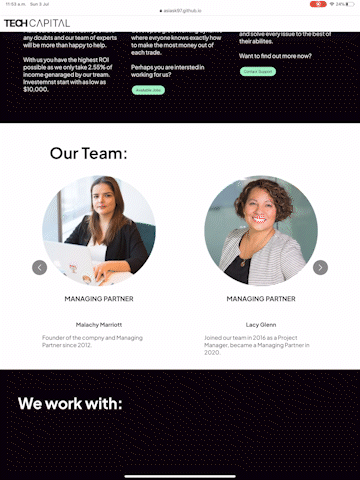
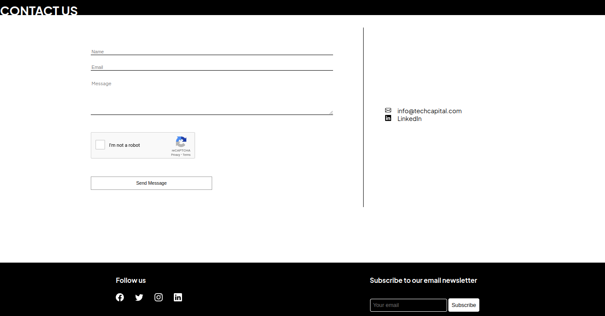
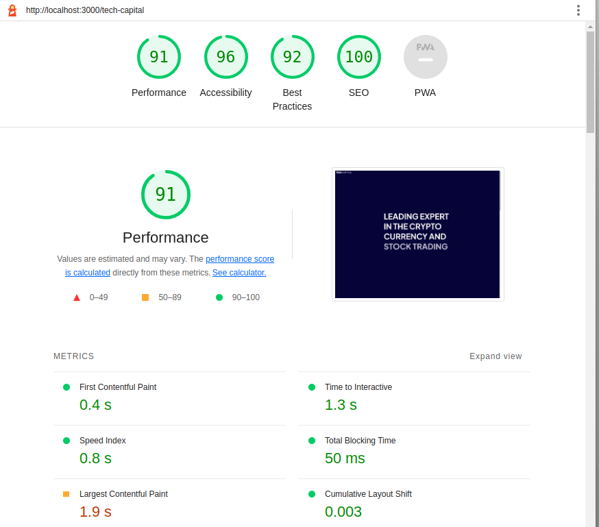

# TECH Capital - Website made with **React** frontend and **AWS serverless** backend

### [Live Webiste](https://asiask97.github.io/tech-capital/)

 
 

# Table of Contents
    1. Introduction
    2. Features
    3. Testing
    4. Credits

# Introduction 
TECH Capital is an animated business card website for a medium company that is looking for investors. When creating this project I tried to keep in mind the target audience, the style of the website is elegant and simple. 

# Features 
## Animations on Scroll
When creating this website, I decided that some features would look better animated. I have included both types of animations, normal ones with CSS that fire on load (writing appearing on the hero section) and animations that fire when a user scrolls down the page (content moving in from side into view)

 

To create animations like this I have used library react-animation-on-scroll which made the animations smooth and easy to implement.  

## Carousel 
Carousel was made with react-responsive-carousel library which helped with quick creation of responsive component that with slight editing was perfectly scalable and original. 
 

## Fully Functioning Form
When deciding on a backend for this website I decided to go with serverless and AWS. I made this choice because it saves me from deploying a backend on to a server for such a small website. I used AWS because I was already familiar with this provider.  

Form is a fully working component that will send an email to the desired email address. Form functionality was made with AWS SES and it works through Gateway API. I have used Serverless to create this whole backend.  
Google reCAPTCHA was added to the form to protect from email spamming and bots. I have also added it to my AWS serverless backend.

# Testing

The website was only manually tested on Chrome dev tools to be responsive on all screens. 

###  Lighthouse Testing
Lighthouse testing was used to improve loading time and performance of the code. 

# Credits

- [Google fonts were used to pick out fonts relevant to the design.](https://fonts.google.com/) 
- [Bootstrap icons were used in the footer](https://icons.getbootstrap.com/) 
- [Images and videos from pexels.com](https://www.pexels.com/) 
- [Animate on Scroll Library](https://www.npmjs.com/package/react-animation-on-scroll) 
- [Carousel Library](https://www.npmjs.com/package/react-responsive-carousel) 